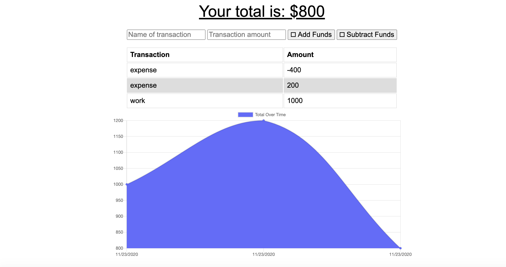
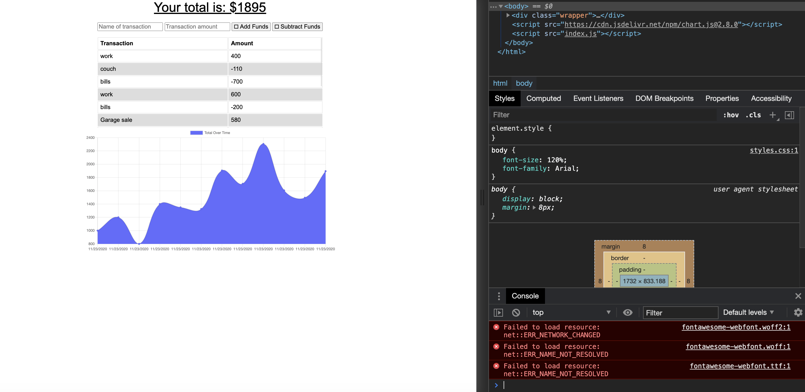
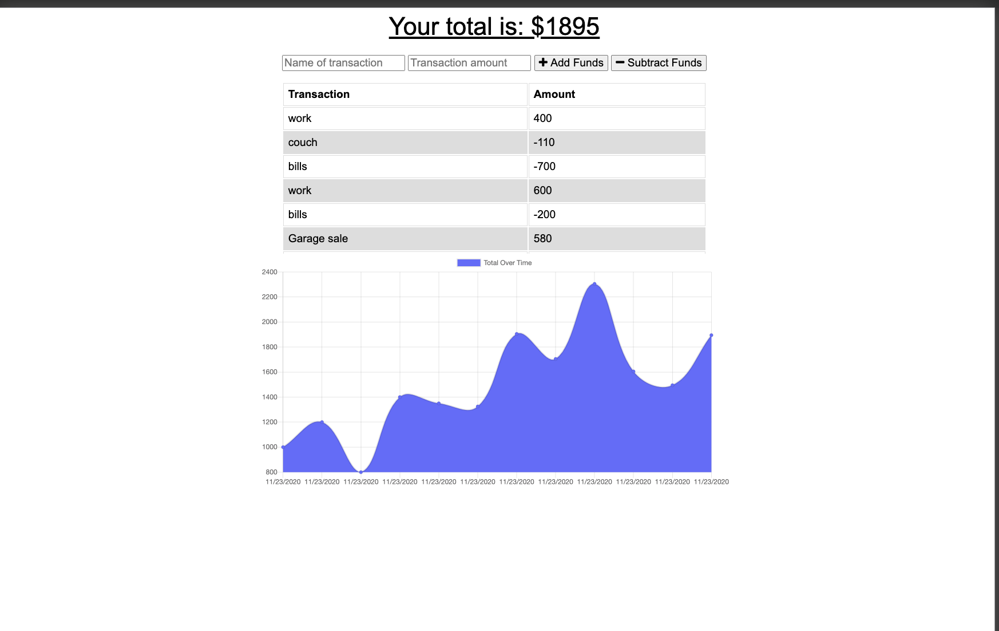

# Unit 18 PWA Homework: Online/Offline Budget Trackers

Add functionality to our existing Budget Tracker application to allow for offline access and functionality.

The user will be able to add expenses and deposits to their budget with or without a connection. When entering transactions offline, they should populate the total when brought back online.

Offline Functionality:

  * Enter deposits offline

  * Enter expenses offline

When brought back online:

  * Offline entries should be added to tracker.

## User Story
AS AN avid traveller
I WANT to be able to track my withdrawals and deposits with or without a data/internet connection
SO THAT my account balance is accurate when I am traveling

## Business Context

Giving users a fast and easy way to track their money is important, but allowing them to access that information anytime is even more important. Having offline functionality is paramount to our applications success.

## Acceptance Criteria
GIVEN a user is on Budget App without an internet connection
WHEN the user inputs a withdrawal or deposit
THEN that will be shown on the page, and added to their transaction history when their connection is back online.

- - -

## ScreenShots
These screenshots show exactly how the application works and how your budget changes based on the additions and subtractions that you apply.

This second screenshot shows the errors that are given when the network connection is lost.

## deployment
To deploy this project you need to begin by doing a npm install for all of the packages that were included in the initial project. Then all of the other files need to be created so that the app can run exactly how it is supposed to. Once all of the errors have been debugged the app needs to be pushed to heroku so it can be viewed properly.